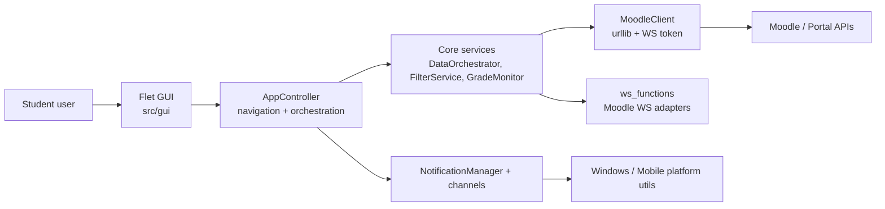

# UTHelper Codebase Architecture Review & Refactoring Plan

Trạng thái: baseline và kế hoạch kiến trúc lịch sử từ đợt audit 2026-07-01.
Quyết định kiến trúc có hiệu lực lâu dài được lưu trong `docs/adr/`.

Ngày audit: 2026-07-01
Phạm vi: `src/`, `tests/`, `.github/workflows/ci.yml`, `.agents/AGENTS.md`, `docs/architecture/refactoring-log.md`
Mục tiêu: đánh giá theo Clean Code, SOLID/OOP, Clean Architecture, C4/ADR và đề xuất kế hoạch refactor có thể thực thi từng bước.

---

## 1. Tài liệu nghiên cứu đã dùng

Nguồn ưu tiên là tài liệu gốc, docs chính thức, hoặc repository/doc có độ tin cậy cao:

- [PEP 8 - Style Guide for Python Code](https://peps.python.org/pep-0008/): chuẩn hóa readability, import grouping, naming, và tính nhất quán trong Python.
- [PEP 20 - The Zen of Python](https://peps.python.org/pep-0020/): nguyên tắc đọc được, rõ ràng, đơn giản hơn phức tạp.
- [Python docs - Classes](https://docs.python.org/3/tutorial/classes.html): nền tảng OOP Python, namespace, class object, method object.
- [Google Python Style Guide on GitHub](https://github.com/google/styleguide/blob/gh-pages/pyguide.md): thực hành Python production, linting, imports, type hints, structure.
- [Robert C. Martin - Design Principles and Design Patterns](https://www.fil.univ-lille.fr/~routier/enseignement/licence/coo/cours/Principles_and_Patterns.pdf): nền tảng OOD/SOLID như OCP, ISP, DIP và dependency management.
- [Martin Fowler - Refactoring](https://martinfowler.com/books/refactoring.html) và [Catalog of Refactorings](https://refactoring.com/catalog/): refactor bằng các bước nhỏ, giữ nguyên hành vi; các kỹ thuật Extract Function/Class, Move Function, Split Phase.
- [Martin Fowler - Dependency Injection](https://martinfowler.com/articles/injection.html): làm rõ dependency qua constructor/setter thay vì service locator ẩn.
- [Uncle Bob - Clean Architecture](https://blog.cleancoder.com/uncle-bob/2012/08/13/the-clean-architecture.html): dependency rule, source code dependency hướng vào core.
- [Microsoft Learn - Common web application architectures](https://learn.microsoft.com/en-us/dotnet/architecture/modern-web-apps-azure/common-web-application-architectures): clean architecture đặt business logic/application model ở trung tâm, infrastructure phụ thuộc vào core qua abstraction.
- [C4 Model](https://c4model.com/): dùng system context/container/component/code để mô tả kiến trúc ở nhiều mức.
- [Architecture Decision Records on GitHub](https://github.com/architecture-decision-record/architecture-decision-record): ghi lại quyết định kiến trúc, context, consequences.
- [Pylint too-many-public-methods](https://pylint.readthedocs.io/en/latest/user_guide/messages/refactor/too-many-public-methods.html): nhiều public methods là tín hiệu vi phạm Single Responsibility.
- [Twelve-Factor Config](https://12factor.net/config): config/secrets nên tách khỏi code và thay đổi độc lập giữa deploys.

---

## 2. Baseline thực tế

### Lệnh đã chạy

```powershell
python -m pytest tests -q --tb=short
ruff check src
ruff check src tests
```

### Kết quả ban đầu

- Test: `296 passed, 22 skipped, 5 warnings in 4.93s`.
- Lint `src`: fail với 13 lỗi Ruff, chủ yếu unused imports và 1 unused local variable.
- Lint `src tests`: fail với 19 lỗi; ngoài 13 lỗi trong `src`, test có một số F841/F541/E712.
- Tổng source Python: `src` có 59 file / 14,621 dòng; `tests` có 29 file / 3,930 dòng.
- README hiện ghi badge `314 passed`; baseline local hiện tại là 296 passed + 22 skipped. Cần cập nhật để tránh docs drift.

### Kết quả sau khi thực hiện Phase 0

- `ruff check src tests`: pass.
- `python -m pytest tests -q --tb=short`: `300 passed, 22 skipped, 5 warnings in 6.36s`.
- Đã thêm `tests/test_architecture_boundaries.py` để khóa các dependency debt hiện hữu và ngăn phát sinh vi phạm mới.
- Đã thêm `docs/adr/0001-refactoring-boundaries.md`.
- README đã được cập nhật test baseline mới.

### Kết quả sau khi hoàn tất Phase 1

- `DetailView` không còn import trực tiếp `core.ws_functions`.
- Đã thêm `src/core/use_cases/submission_workflow.py` để gom workflow load submitted files, submit append/overwrite, remove files, update metadata.
- Đã thêm DTO: `SubmissionTarget`, `SelectedSubmissionFile`, `SubmittedFile`, `FileMetadataUpdate`, `SubmittedFilesResult`.
- `DetailView` nhận `submission_workflow_factory` từ `AppController`, không tự tạo implementation trong wrapper.
- Đã thêm `tests/test_submission_workflow.py` với fake Moodle client.
- `tests/test_architecture_boundaries.py` đã được siết allowlist: nợ `DetailView -> core.ws_functions` đã được xóa.
- `ruff check src tests`: pass.
- `python -m pytest tests -q --tb=short`: `311 passed, 22 skipped, 5 warnings`.

### Kết quả sau khi hoàn tất Phase 2/3

- Đã thêm `src/core/use_cases/grade_refresh.py` để tách workflow tải điểm/unread badge khỏi `AppController`.
- `MoodleService` có thêm `get_current_user_id()` và `fetch_all_grades()`.
- `AppController` không còn import `from core import ws_functions`; cache clearing, grade fetch, unread badge đi qua service/use case.
- Đã thêm `tests/test_moodle_service.py` và `tests/test_grade_refresh_service.py`.
- Đã thêm `src/gui/controllers/refresh_coordinator.py` để tách merge cache chi tiết, smart merge pending submission, sort, precompute hot fields, progress status khỏi `AppController`.
- `AppController._load_data_async` còn 86 dòng; cache display, notifier dispatch, post-refresh scheduling đã tách thành method riêng.
- `DataOrchestrator`, `GradeMonitor`, `SubmissionWorkflow` đã dùng `MoodleService` boundary thay vì import/call raw `ws_functions`.
- Đã thêm `tests/test_refresh_coordinator.py`, `tests/test_data_orchestrator_service_boundary.py`, `tests/test_grade_monitor_service_boundary.py`.
- `tests/test_architecture_boundaries.py` đã siết allowlist: không còn debt `gui -> core.ws_functions/core package import`.
- `tests/test_architecture_boundaries.py` khóa thêm rule: chỉ `core.moodle_service` được import adapter `core.ws_functions`.
- `ruff check src tests`: pass.
- `python -m pytest tests -q --tb=short`: `322 passed, 22 skipped, 5 warnings`.

### File lớn nhất

| File | Lines | Classes | Functions/Methods | Nhận xét |
|---|---:|---:|---:|---|
| `src/gui/components/settings_view.py` | 1955 | 1 | 85 | God View đang giảm nhưng vẫn gom settings, debug tools, theme preview, save flow |
| `src/gui/app_controller.py` | 1810 | 1 | 79 | Composition root + navigation + fetch orchestration + notification + update + grades |
| `src/gui/components/detail_view.py` | 1574 | 1 | 35 | UI detail + upload/re-upload/delete/metadata Moodle workflow |
| `src/gui/components/calendar_view.py` | 1009 | 1 | 23 | Rendering tháng/tuần và card logic con khá lớn |
| `src/core/ws_functions.py` | 936 | 0 | 25 | Adapter Moodle WS đang gom nhiều mapping, parsing, mutation calls |

### Hàm/method có rủi ro cao

| Function | Lines | Branches | Rủi ro |
|---|---:|---:|---|
| `DetailView._init_controls` | 336 | 0 | UI object graph quá lớn, khó review và khó đổi theme/layout cục bộ |
| `show_login_dialog` | 249 | 17 | Function-level component + nested handlers, khó test riêng |
| `DetailView.update_detail` | 247 | 45 | Trộn render, business rules, translation, async side effects |
| `CalendarView._build_ui` | 208 | 5 | UI assembly quá dài |
| `patch_flet` | 198 | 37 | Compatibility patch có rủi ro framework drift |
| `EmailNotifier.notify` | 179 | 25 | Channel notify gom filtering/formatting/sending/error handling |
| `AppController._load_data_async` | 175 | 38 | Data fetch, cache, smart merge, notification, background task scheduling |
| `SettingsView._refresh_section_colors` | 170 | 47 | Theme refresh dựa trên danh sách tên field thủ công |
| `DataOrchestrator._merge_all_assignments` | 158 | 41 | API merge + domain policy + DTO construction trong cùng method |

---

## 3. Kiến trúc hiện tại

### C4 container level rút gọn



### Điểm tốt

- Package boundary đã có hình dáng rõ: `gui`, `core`, `notifiers`, `platform_utils`.
- Core không import GUI; đây là điểm nên giữ.
- Config đã tách secret khỏi JSON bằng `exclude=True`, có tier secure storage/keyring.
- `SafeFileIO` có atomic write, per-file lock, retry, và test riêng.
- Đã có regression test cho race condition submission status.
- Notification cache và offline data cache đã chuyển về user data directory, tốt hơn so với source dir.
- Refactor lịch sử đã tách `ColorPicker`, settings sections, `ViewManager`, `SubmittedFilesTable`, `MoodleService`.

### Điểm yếu chính

1. `AppController` vẫn là god coordinator.
   - Bằng chứng: constructor khởi tạo window, UI, loops, update check, scheduler, login/data load tại `src/gui/app_controller.py:48`.
   - `_load_data_async` gom fetch, cache, smart merge, notification dispatch, prefetch, badge update tại `src/gui/app_controller.py:916`.
   - Vi phạm SRP: nhiều lý do để thay đổi trong cùng class.

2. Presentation đang thao tác trực tiếp Moodle workflows.
   - `DetailView._do_submit_sync` import `core.ws_functions` và tự resolve cmid, upload, save, submit tại `src/gui/components/detail_view.py:1017`.
   - `DetailView._do_update_metadata_sync` tại `src/gui/components/detail_view.py:1502` tiếp tục re-upload tất cả file và save submission trong view.
   - Điều này làm UI phụ thuộc vào infrastructure details, ngược với Clean Architecture.

3. Dependency direction trong GUI còn lỏng.
   - Components có import `gui.app_controller` ở demo/runtime helpers: `calendar_view.py:1005`, `detail_view.py:1570`, `settings_view.py:1389`, `settings_view.py:1951`, `grade_overview_view.py:219`.
   - Analyzer thấy SCC lớn: `main`, `compact_desktop`, `AppController`, và các view. Một phần có thể nằm trong demo blocks, nhưng vẫn nên tách demo khỏi production module.

4. `MoodleService` đã thành facade chính sau Phase 2/3.
   - `ws_functions` được giữ làm adapter thấp tầng phía sau service.
   - `DataOrchestrator._merge_all_assignments` vẫn còn gom mapper/policy/domain DTO và nên tách tiếp ở Phase 5.

5. Domain model đang phụ thuộc global settings.
   - `src/models.py:5` import `settings`; `Assignment.urgency` đọc global threshold tại `src/models.py:49`.
   - Làm model khó test deterministic và khó dùng lại trong context khác. Nên đưa urgency threshold vào policy/service.

6. Lint gate đang vỡ.
   - CI hiện chạy `ruff check src/`; baseline local fail 13 lỗi.
   - Đây là việc nhỏ, nhưng nếu CI thật sự chạy trên branch này thì sẽ fail.

7. Tài liệu và rule agent bị drift.
   - `.agent/learning/workflow.md` còn nói `requests`, `parser.py`, Windows-only, và metrics 2026-06-16 đã cũ.
   - `.agents/AGENTS.md` cũ trỏ tới đường dẫn `.gemini/.../implementation_plan.md` ngoài repo; agent sau không đảm bảo đọc được.
   - README test badge `314 passed` lệch với local `296 passed, 22 skipped`.

---

## 4. Đánh giá theo Clean Code / SOLID / OOP

| Principle | Điểm | Nhận xét |
|---|---:|---|
| Readability | 3/5 | Tên module/hạng mục tốt, nhiều comment hữu ích; nhưng file/method dài làm reviewer mất ngữ cảnh |
| SRP | 2/5 | `AppController`, `SettingsView`, `DetailView`, `DataOrchestrator` có nhiều lý do để thay đổi |
| OCP | 3/5 | Notification channels có interface tốt; Moodle activity type/rendering còn nhiều conditional |
| LSP | 4/5 | Ít inheritance phức tạp, rủi ro thấp |
| ISP | 3/5 | `BaseNotifier` gọn; nhưng UI callbacks/orchestrator surface chưa rõ, `MoodleService` facade quá rộng |
| DIP | 2/5 | Core facade đang có nhưng presentation vẫn gọi concrete `ws_functions`/client; DI còn bằng callback ad-hoc |
| Testability | 3/5 | Test nhiều và pass, nhưng controller/view test phải dùng `__new__`, fake page, monkeypatch global |
| Architecture docs | 2/5 | README có tree, refactoring log có log; thiếu ADR/C4 và nguồn sự thật trong repo |

Kết luận: codebase đang ở trạng thái "functional but transitional". Nó có nhiều dấu vết refactor đúng hướng, nhưng chưa hoàn tất boundary giữa presentation, application service, infrastructure.

---

## 5. Kiến trúc đích đề xuất

Mục tiêu không phải "over-engineer Clean Architecture", mà là tạo boundary vững chắc cho những workflow có rủi ro: refresh activities, submission/file operations, grades, notifications.

```text
src/
  models.py                       # pure data, không đọc settings global
  core/
    policies/
      urgency_policy.py           # thresholds vào constructor/config snapshot
    use_cases/
      activity_refresh.py         # fetch + merge + cache policy
      submission_workflow.py      # upload/re-upload/delete/update metadata
      grade_refresh.py            # load + diff grades
      notification_dispatch.py    # thin wrapper around manager
    moodle/
      client.py                   # current MoodleClient
      ws_api.py                   # current ws_functions as low-level adapter
      service.py                  # high-level facade, mock-friendly
    cache/
      data_cache.py
      notification_history.py
  gui/
    app_controller.py             # composition root + event wiring only
    controllers/
      refresh_controller.py
      navigation_controller.py
      update_controller.py
    view_models/
      activity_vm.py
      detail_vm.py
      settings_vm.py
```

Dependency rule mong muốn:

```text
gui -> core.use_cases -> core.moodle/service/cache -> infrastructure details
models/policies -> no gui, no platform, minimal/no global config
notifiers -> core display/time helpers only, không gọi gui
platform_utils -> no gui core import ngược nếu không cần
```

---

## 6. Kế hoạch refactor

### Phase 0 - Ràng buộc và tài liệu nguồn sự thật

Mục tiêu: không đổi behavior, chỉ làm cho repo có baseline rõ.

- [x] Sửa 13 lỗi Ruff trong `src`.
- [x] Sửa lỗi lint nhỏ trong `tests` để `ruff check src tests` pass.
- [x] Cập nhật README test count từ `314 passed` sang baseline mới.
- [x] Thêm ADR đầu tiên: `docs/adr/0001-refactoring-boundaries.md`.
- [x] Chốt rule agent trong `.agents/AGENTS.md`: mọi agent phải đọc plan này, `docs/architecture/refactoring-log.md`, chạy test/lint baseline trước/sau refactor.

Điều kiện nghiệm thu:

- `ruff check src tests` pass.
- `python -m pytest tests -q --tb=short` pass.
- README/rules không trỏ tới path ngoài repo.

### Phase 1 - Tách submission workflow khỏi `DetailView`

Mục tiêu: UI chỉ điều phối state và hiển thị; Moodle write workflow nằm trong service test được.

- [x] Tạo `src/core/use_cases/submission_workflow.py`.
- [x] Chuyển logic từ:
  - `DetailView._do_submit_sync`
  - `_load_submitted_files`
  - `_do_remove_file_sync`
  - `_do_update_metadata_sync`
- [x] Dùng input/output DTO: `SubmissionTarget`, `SelectedSubmissionFile`, `SubmittedFile`, `FileMetadataUpdate`, `SubmittedFilesResult`.
- [x] `DetailView` nhận service qua constructor/callback từ `AppController` thay vì tạo service trong wrapper.
- [x] Viết unit tests service với fake Moodle client.

Điều kiện nghiệm thu:

- `DetailView` không import `core.ws_functions`.
- Submission workflow có test success/fail/metadata/delete guard.
- Race-condition test vẫn pass.

### Phase 2 - Rút gọn `AppController`

Mục tiêu: `AppController` thành composition root và event wiring, không còn gom tất cả business flow.

- [x] Tạo `RefreshCoordinator` cho merge cache chi tiết, smart merge pending submission, sort urgency/deadline, precompute hot fields, dataset result, progress status.
- [x] Tách cache display, notifier dispatch, post-refresh scheduling khỏi `_load_data_async`.
- [ ] Tiếp tục mở rộng coordinator cho `_auto_poll_loop`, `_check_grades_background` ở phase AppState/background lifecycle sau.
- Tạo `NavigationController` hoặc mở rộng `ViewManager` để không cần truyền toàn bộ `controller`.
- Tạo `AppState` nhỏ gom filters, all_data, pending_updates, locks.
- Chuyển update checking sang `UpdateController`.
- Giới hạn `AppController` còn khoảng 500-800 dòng trước khi tách tiếp.

Điều kiện nghiệm thu:

- `AppController._load_data_async` dưới 100 dòng và không còn chứa thuật toán merge/sort/precompute/status progress.
- Không có method nào trong `AppController` > 100 dòng, trừ trường hợp có lý do ghi chú.
- Existing AppController tests pass và đã thêm unit tests cho refresh coordinator thuần dữ liệu.

### Phase 3 - Làm `MoodleService` thành boundary chính

Mục tiêu: một facade high-level cho Moodle, mock-friendly, không để presentation/core use cases gọi raw wrappers lung tung.

- [x] Thêm `get_current_user_id`.
- [x] Thêm `fetch_all_grades`.
- [x] Sửa `get_assign_details_via_ws` để nhận đủ `course_id` và `modulename`.
- [x] Thêm boundary methods cho activity feed/detail/event mapping/submission workflow hiện tại.
- [ ] Đổi tên/gom tiếp thành workflow-level methods rõ nghĩa hơn nếu Phase 5 tách mapper:
  - `fetch_activity_feed`
  - `fetch_activity_detail`
  - `submit_assignment_files`
  - `replace_submission_files`
- Đổi `ws_functions.py` thành adapter thấp hơn, pure wrappers/transformers.
- Di chuyển cache global trong `ws_functions` vào service instance nếu khả thi.

Điều kiện nghiệm thu:

- `src/gui/**` không import `core.ws_functions`.
- `DataOrchestrator`, `GradeMonitor`, `SubmissionWorkflow` phụ thuộc vào `MoodleService`/service-like fake thay vì concrete raw functions.
- Fakes trong tests mới không cần mock global module.

### Phase 4 - SettingsView cleanup

Mục tiêu: giảm brittle attribute-list và tiêu diệt god view còn lại.

- Tách debug panel thành `src/gui/components/settings/debug_panel.py`.
- Tạo `SettingsFormState` hoặc `SettingsDraft` để load/save UI values thay vì đọc từng field trong `_save`.
- Theme refresh: các section đăng ký controls qua interface (`register_themeable(control)`) thay vì `_all_fields` list hard-coded.
- Để mỗi settings section expose:
  - `init_controls(view)`
  - `load_from(settings)`
  - `collect_into(draft)`
  - `apply_theme()`

Điều kiện nghiệm thu:

- `SettingsView._refresh_section_colors` < 60 dòng.
- `SettingsView._save` < 80 dòng.
- Debug panel có test/build smoke riêng nếu Flet cho phép.

### Phase 5 - Tách DataOrchestrator merge và policy

Mục tiêu: để core logic đọc như pipeline, không bị trộn API response details.

- Extract `ActivityMerger` từ `_merge_all_assignments`.
- Extract `ActivityMapper` từ `ws_events_to_assignments` và assignment DTO mapping.
- Tạo `UrgencyPolicy` thay cho threshold global trong model/mapper.
- Tạo tests cho:
  - calendar item + assignment API duplicate cmid
  - cutoff vs duedate late status
  - overdue/include past due

Điều kiện nghiệm thu:

- `_merge_all_assignments` < 60 dòng hoặc biến mất.
- `models.py` không import `config.settings`.
- Urgency threshold test được bằng config snapshot.

### Phase 6 - Architecture enforcement

Mục tiêu: tránh tái phát architectural drift.

- Thêm script/test static import boundary bằng `pytest-archon`, `grimp/import-linter`, hoặc custom AST test nhẹ.
- Rule để enforce:
  - `core` không import `gui`.
  - `gui.components` không import `gui.app_controller`.
  - `gui` không import `core.ws_functions`.
  - `models` không import `config`.
- Thêm C4 docs: `docs/architecture/c4-context.md`, `c4-container.md`, `c4-component-core.md`.
- Bắt buộc ADR cho mỗi thay đổi boundary lớn.

Điều kiện nghiệm thu:

- Static architecture test pass trong CI.
- PR/refactor sau có checklist boundary.

---

## 7. Việc nhỏ nên làm trước

1. Sửa các unused imports/local var của Ruff. Rủi ro cực thấp, giúp CI xanh.
2. Cập nhật `.agents/AGENTS.md` và README test badge/count.
3. Xóa hoặc chuyển demo imports `from gui.app_controller import AppController` ra file example/smoke riêng.
4. Tạo `SubmissionWorkflow` trước vì đây là vùng có risk cao nhất: file upload/delete/metadata + UI async.
5. Thêm architecture boundary test trước khi tách lớn, để biết mình có làm xấu hơn không.

---

## 8. Rủi ro và cách giảm rủi ro

- Moodle WS behavior có nhiều edge case thực tế. Giảm rủi ro bằng test với fake client và giữ live integration tests skip mặc định.
- Flet UI rendering canvas khó e2e DOM. Giảm rủi ro bằng smoke tests cho state/viewmodel và manual web/desktop check sau phase UI.
- `urllib` và Cloudflare behavior đã được ghi là quyết định thực dụng. Không đổi HTTP stack trong refactor kiến trúc.
- Tách file quá nhanh dễ gây regression ẩn. Dùng Fowler-style small steps: mỗi phase pass test/lint, mỗi extraction có shim/backward compat.

---

## 9. Định nghĩa hoàn tất cho mỗi phase

- Không đổi hành vi user-facing nếu phase là refactor.
- `python -m pytest tests -q --tb=short` pass.
- `ruff check src tests` pass.
- Nếu chạm UI: manual smoke `python src/main.py --web` hoặc desktop theo docs hiện hành.
- Cập nhật `docs/architecture/refactoring-log.md` với ngày, phase, files touched, test status.
- Nếu thay đổi boundary: thêm/cập nhật ADR.
